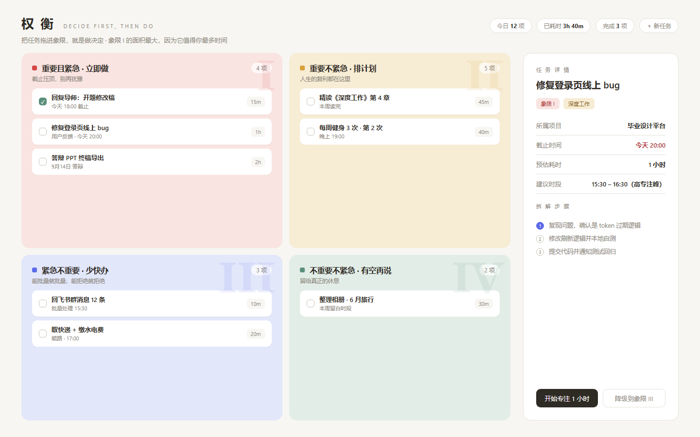
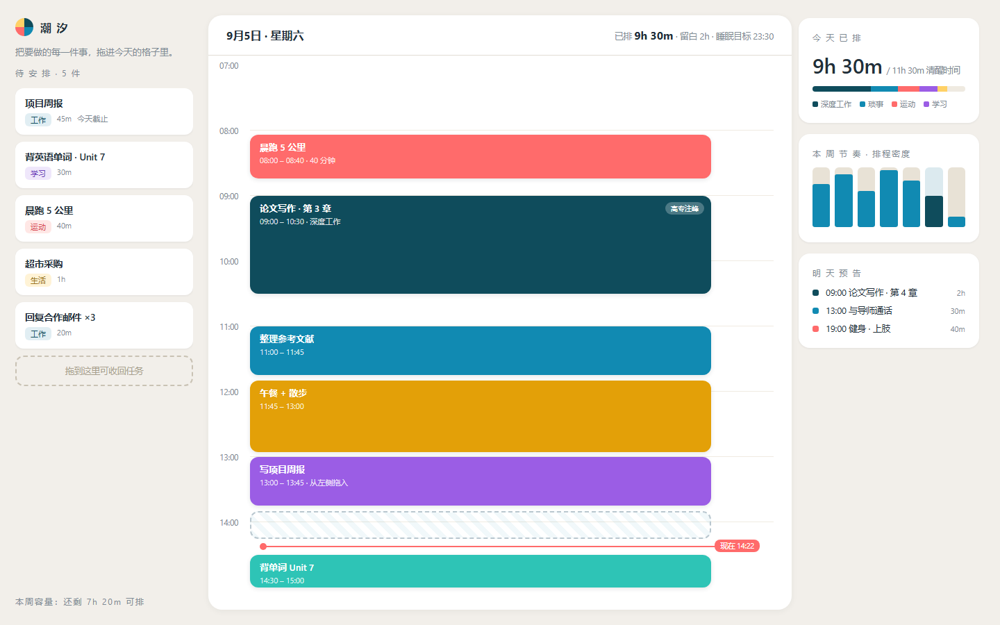

# 潮衡 TideBalance

把 **四象限决策** 与 **时间块规划** 合成一个本地优先的时间管理桌面/移动应用。

- [`tidebalance/`](./tidebalance) —— 软件本体：Tauri 2 + 原生 JS，支持 Windows / Linux / Android，内置插件系统与中文时间捕获
- [`ui-概念稿/`](./ui-概念稿) —— 10 个 UI 方向的高保真概念稿（本项目由 03「权衡」+ 04「潮汐」融合而来）

## 功能一览

| | |
|---|---|
| 四象限视图 | 重要/紧急四象限，详情抽屉，一键排入时间块 |
| 时间块视图 | 任务池拖进 24h 时间轴（鼠标/触摸），现在红线、7 天节奏 |
| 捕获 | 拖入/粘贴聊天文字、网页链接、截图 → 中文时间解析 → 自动创建事件 |
| 插件 | 内置番茄专注、周度报告；支持用户插件目录热加载 |
| 本地优先 | 单 JSON 文件存储，无账号无联网，支持备份导出/导入 |

## 快速开始

```bash
cd tidebalance
npm install
npm run tauri dev      # 开发模式
npm run tauri build    # 打包（Windows: NSIS/MSI；Linux: deb/AppImage）
```

Android：`npm run tauri android init && npm run tauri android build`（需 Android SDK/NDK）。

详细文档见 [`tidebalance/README.md`](./tidebalance/README.md)，插件开发 API 也在其中。

## 截图

| 四象限（03 权衡） | 时间块（04 潮汐） |
|---|---|
|  |  |
